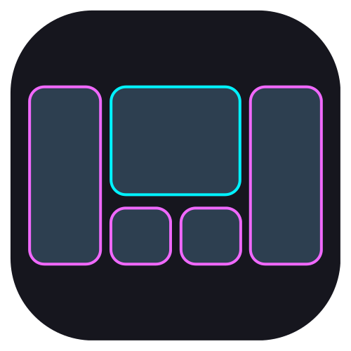

# Raven Tiling Emulator 🐦

<p align="center">
  
</p>


**Raven Tiling Emulator** es un gestor de ventanas dinámico en mosaico (Tiling Window Manager) de alto rendimiento diseñado específicamente para **KDE Plasma 6 (Wayland)**. 

Con el lanzamiento de la **Versión 3.0**, implementa una arquitectura modular en Rust nativo, comunicación de ultra-baja latencia **Single-Trip IPC**, 5 algoritmos de ordenamiento espacial y mejora su integración con navegadores web base **Gecko**.

---

## ⚡ Novedades Principales de la Versión 3.0

### 📐 1. Módulo de Layouts Rediseñado y Modular (Domain-Driven Architecture)
El motor geométrico se ha reestructurado por completo en submódulos especializados dentro de `domain/layout/`, ofreciendo desacoplamiento total y 5 algoritmos de distribución seleccionables:

| Algoritmo | Identificador | Descripción y Caso de Uso |
| :--- | :--- | :--- |
| **Raven (BSP Foveal)** | `"raven"` | Composición dinámica foveal con ranuras de utilidad laterales e inferiores para monitores ultrapanorámicos. |
| **Clásico (Tall)** | `"tall"` | Columna maestra principal en el lateral con apilamiento secundario vertical. |
| **Monóculo** | `"monocle"` | Maximización total enfocada de una sola ventana para concentración intensiva. |
| **Flujo Avanzado** | `"strict_dwindle"` | División fractal en espiral binaria simétrica secuencial. |
| **Flujo Avanzado (Invertido)** | `"inverted_strict_dwindle"` | División fractal en espiral binaria simétrica secuencial con orden de acomodo invertido. |
| **Divisor** | `"divisor"` | Reparto equitativo proporcional en $N$ columnas verticales. |

### 🚀 2. Arquitectura Single-Trip D-Bus IPC (zbus 4)
- **Cero Polling y Tráfico Optimizado**: Se eliminaron las transmisiones masivas de estado redundantes. El script de KWin y el motor de Rust interactúan mediante un modelo síncrono de consulta-respuesta en un solo viaje IPC (`syncStateAndUpdateLayout` y `syncWindowDelta`).
- **Reducción del 90% en Bus IPC**: Minimiza el uso de CPU de KWin y elimina cuellos de botella en composiciones complejas.

### 🎨 3. Centro de Control Nativo (`raven_gui`) con Temática KDE
- **Interfaz en egui/eframe**: Aplicación gráfica ligera para configurar márgenes (gaps), ratios maestros, posiciones PiP y reglas dinámicas.
- **Previsualizador de Canvas en Vivo**: Renderiza espacialmente la distribución del layout seleccionado en tiempo real antes de aplicarlo.
- **Sincronización de Paleta KDE**: Lee dinámicamente la configuración de colores del sistema desde `~/.config/kdeglobals`, adaptando su apariencia a cualquier tema claro u oscuro de Plasma.

### 🦊 4. Mejoras en la Mitigación Nativa para Navegadores Gecko
- **Cuarentena Dinámica y Bandera `sb`**: Identifica automáticamente la creación de ventanas de navegadores Gecko notificando su tamaño definitivo tras estabilizar sus decoraciones CSD/SSD, previniendo parpadeos, encimamientos o desacomodos.

---

## 📉 Eficiencia Energética, Huella en Disco y Rendimiento (v3.0)

El proyecto prioriza la eficiencia extrema y el uso mínimo de recursos del sistema.

### 📊 Evolución del Consumo por Versión

| Versión | Arquitectura | RAM (Runtime) | Peso Binario Motor | Tráfico IPC |
| :--- | :--- | :--- | :--- | :--- |
| **v1.0** | Python Puro | 55.0 MB | ~15 MB | Alto (Polling continuo) |
| **v1.6** | Híbrida (Python + Rust FFI) | ~25.9 MB | ~18 MB | Medio |
| **v2.6** | Rust Nativo Asíncrono | ~4.3 MB | 1.4 MB | Continuo |
| **v2.9** | Rust Nativo (Flood Protection) | ~4.5 MB | 1.4 MB | Debounced |
| **v3.0** | **Rust Nativo (Single-Trip IPC & 5 Layouts)** | **~4.9 MB** | **1.9 MB** | **Ultra-bajo (-90%)** |

### 💾 Desglose de Almacenamiento e Instalación Local (v3.0)

| Componente | Tipo de Recurso | Tamaño en Disco | Notas Técnicas |
| :--- | :--- | :--- | :--- |
| **`raven_engine`** | Daemon Nativo en Rust | **1.9 MB** *(1,995 KB)* | Incluye los 5 algoritmos de layout, topología PiP e IPC Single-Trip (zbus 4). |
| **`raven_gui`** | Centro de Control (egui/eframe) | **4.3 MB** *(4,596 KB)* | Renderizado GPU nativo OpenGL, selector de presets y lector de paletas KDE. |
| **Adaptadores & Plasmoides** | KWin Script & Plasmoid QML | **< 60 KB** | Puente sensor-actuador ligero para Plasma 6. |
| **Total Instalación** | Entorno Local (`~/.local/share/raven/`) | **6.9 MB** | **Huella ultra-compacta en almacenamiento.** |

---

## 🏗️ Estructura del Proyecto

- **`core/engine_rs/`**: Núcleo principal en Rust nativo (Daemon systemd).
  - `domain/layout/`: Algoritmos de ordenamiento espacial (`dwindle_bsp`, `tall`, `monocle`, `strict_dwindle`, `divisor`, `topology`, `strategy`, `utils`).
  - `infrastructure/dbus.rs`: Servicio D-Bus zbus 4 que expone la interfaz `org.kde.raven.Events`.
- **`crates/raven_core/`**: Biblioteca de entidades de dominio, geometría (`Rect`, `WindowNode`) y configuración JSON.
- **`raven_gui/`**: Centro de preferencias nativo basado en egui.
- **`adapters/`**:
  - `kwin_script/`: Puente liviano para la API de KWin de Plasma 6, organizado en submódulos especializados:
    - `utils/`: Módulos del sistema (`logger`, `geometry`, `timer_pool`).
    - `core/`: Reglas de ventanas (`window_utils`), cuarentena CSD (`quarantine`) y foco direccional (`focus`).
    - `services/`: Puente de eventos D-Bus IPC (`dbus_bridge`) e inyección de atajos globales (`shortcuts`).
  - `plasmoid/`: Widget de Plasma 6 para control rápido y estado desde el panel.

---

## 🛠️ Instalación y Uso

### Requisitos Previos
- **KDE Plasma 6** sobre **Wayland**.
- Compilador de Rust (Cargo) y herramientas base de compilación (`build-essential` / `pkg-config`).

### Pasos de Instalación
```bash
git clone https://github.com/Vidruck/raven_tiling_emulator.git
cd raven_tiling_emulator
./install.sh
```

El script `./install.sh` se encarga de:
1. Compilar los binarios nativos optimizados en modo `--release`.
2. Registrar el script de KWin y el Plasmoide en Plasma 6.
3. Configurar e iniciar el servicio `systemd` del usuario (`raven.service`).

### Atajos de Teclado Predeterminados (KWin)

| Atajo | Función |
| :--- | :--- |
| **`Super + Space`** | Habilitar / Deshabilitar el motor de mosaico |
| **`Super + Shift + C`** | Ciclar entre los 5 algoritmos de layout |
| **`Super + J` / `Super + K`** | Mover el foco a la ventana Siguiente / Anterior |
| **`Super + Shift + J` / `Super + Shift + K`** | Intercambiar posición de la ventana activa |
| **`Super + Equal` / `Super + Minus`** | Incrementar / Decrementar espaciado (Gaps) |
| **`Super + Shift + Right` / `Left`** | Migrar ventana activa al Monitor siguiente / anterior |

---

## 🦊 Recomendación de Configuración para Navegadores (Gecko / CSD)

Los navegadores basados en Gecko (Firefox, Floorp, LibreWolf, Zen) en Wayland utilizan por defecto decoraciones en el lado del cliente (CSD). Aunque Raven v3.0 incluye mitigación en cuarentena, para una experiencia 100% fluida se sugiere activar las decoraciones del lado del servidor (SSD):

1. Abre tu navegador Gecko.
2. Haz clic derecho en la barra de herramientas o abre **Personalizar barra de herramientas...**
3. En la esquina inferior izquierda, activa la casilla **Barra de título (Title Bar)**.

---

## 🧹 Desinstalación

Para remover completamente Raven y sus componentes del sistema:
```bash
./uninstall.sh
```

---

## ⚠️ Descargo de Responsabilidad (Disclaimer)

**Este software se proporciona "tal cual" (AS IS), sin garantía de ningún tipo.** Raven interactúa directamente con el compositor KWin y el bus D-Bus de Plasma. El usuario asume la responsabilidad de su uso.

---

*Desarrollado por **Alejandro González Hernández (Vidruck)**. Licencia **GPL-3.0**.*  
*¡Huélum!*